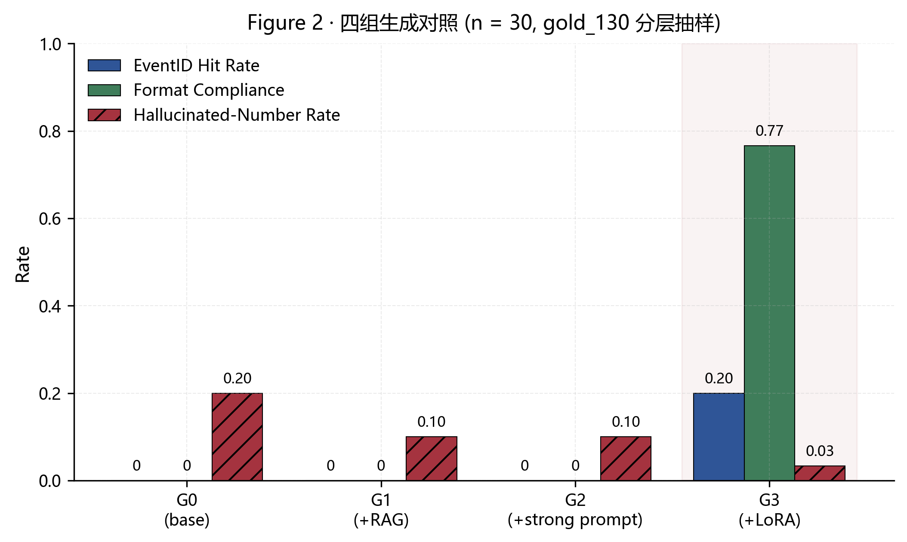
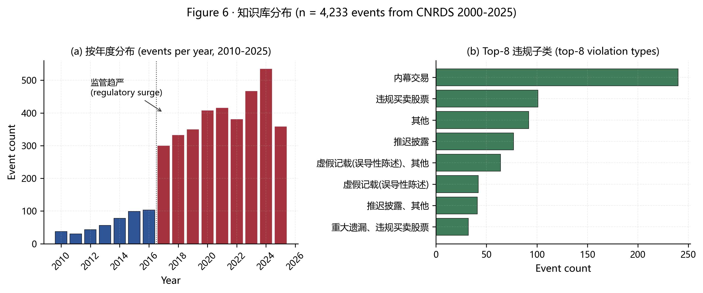
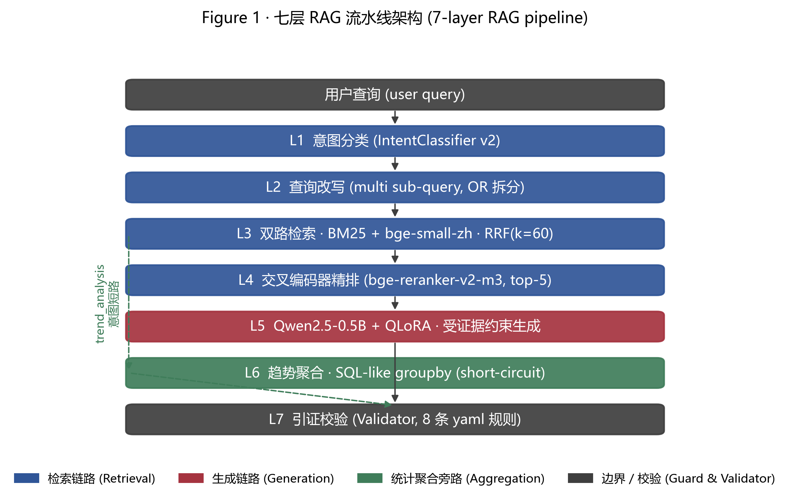
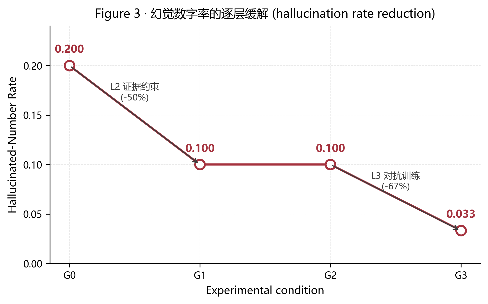
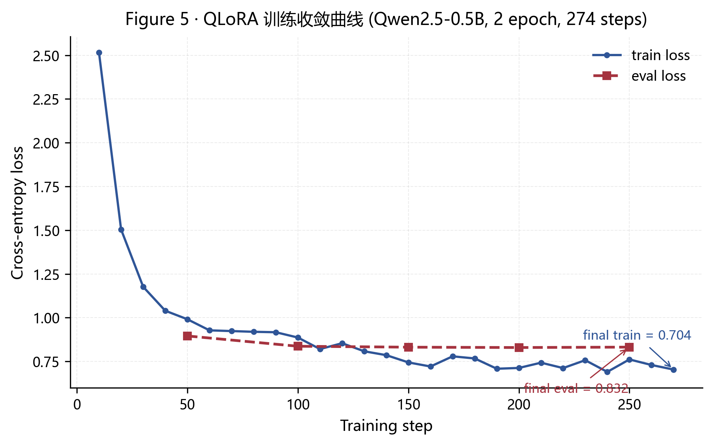
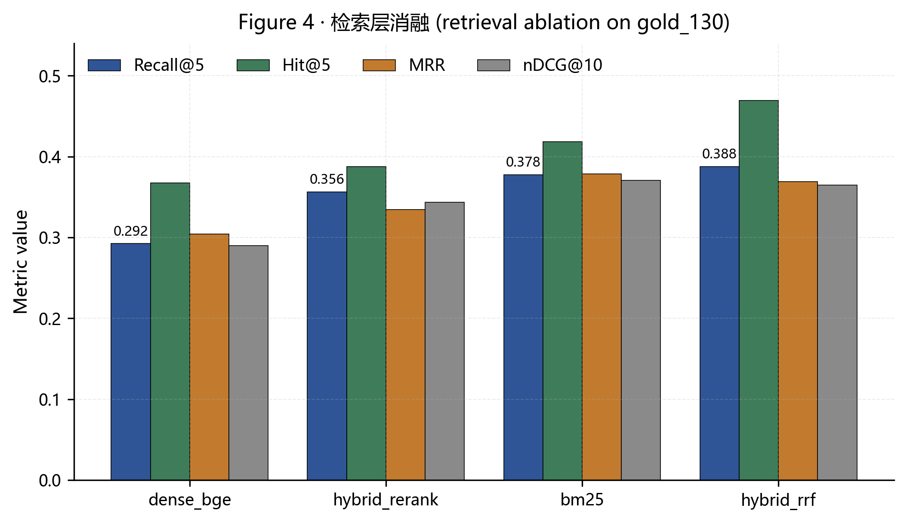

# CSRC-RAG · 证监会违规案例检索增强问答系统

> 一个面向中国证监会行政处罚公告的端到端 RAG 问答系统。
> 在 **Qwen2.5-0.5B-Instruct** 基座上以 **QLoRA** 指令微调,
> 将幻觉数字率从 **20% 压到 3.3%**(相对下降 83%),
> 格式合规率从 **0 提升至 76.7%**,全流程在 **8 GB 消费级 GPU** 上跑通。

<p align="center">
  
  
  
  
  
</p>

**深度学习课程设计 · 赛道 B(垂直领域智能问答)** · 2026.04

作者:许浩财 · 贾彤 · 戴一鑫 · 张彦扬 · 王怡菲

---

## 🎯 核心成果一图看懂

<p align="center">
  
</p>

**一张图说透**:G0 / G1 / G2 三组(微调前)**EID 命中率与格式合规率均为 0%**,即便加了最强约束 prompt 也无效;G3(+LoRA)一跃至 **76.7% 格式合规、20% EID 命中、3.3% 幻觉率** —— 在 <1B 中文基座上,结构化引用格式**必须靠微调习得**,prompt 工程补不了。

---

## 📑 目录

- [一、项目在做什么](#一项目在做什么)
- [二、核心成果一览](#二核心成果一览)
- [三、5 分钟快速上手](#三5-分钟快速上手)
- [四、系统架构:七层流水线](#四系统架构七层流水线)
- [五、幻觉缓解的三层防线](#五幻觉缓解的三层防线)
- [六、四组对照实验(微调前后)](#六四组对照实验微调前后)
- [七、完整交付物清单](#七完整交付物清单)
- [八、目录结构](#八目录结构)
- [九、从零复现](#九从零复现)
- [十、文档与报告索引](#十文档与报告索引)
- [十一、已知局限](#十一已知局限)
- [十二、技术栈](#十二技术栈)

---

## 一、项目在做什么

### 一句话概括

**把 4,233 条证监会违规处罚公告变成一个会精确引用、拒绝编造的智能问答助手。**

### 背景:为什么做这个

- 中国证监会 2017 → 2024 年行政处罚案件数从 **299 起** 增长到 **534 起**(七年增 78%)
- 合规从业人员需要对海量处罚公告做三类操作:**同类案件检索**、**法条依据关联**、**处罚分布统计**
- 通用大语言模型在此类垂直法律语料上有三个典型短板:
  1. 零样本场景大量编造不存在的法条、罚款金额、公司名称(**幻觉**)
  2. 不遵守结构化引用格式(**格式不合规**)
  3. 领域术语(内幕交易 / 虚假记载 / 市场禁入)的向量化质量偏弱(**检索召回低**)

本项目用一套完整的 RAG + 指令微调 + 规则校验方案系统性地解决这三个问题。

<p align="center">
  
  <br/>
  <sub><b>Figure 6</b> · 知识库语料分布 —— 左:按年度 · 右:Top-8 违规子类(n = 4,233)</sub>
</p>

### 适合谁

| 你是 | 你能从本仓库得到什么 |
|---|---|
| 想学 RAG 的学生 | 一套**严格控制变量的 G0→G3 四组消融**作为经典教材 |
| 想学 QLoRA 的工程师 | 52 分钟完成训练的可复现流程,包含完整数据构造 + Colab 备选 |
| 想做合规问答产品的团队 | 完整的七层架构 + 8 条 YAML 校验规则 + 可审计部署方案 |
| 本课程助教/同学 | 赛道 B 的完整交付样本(论文 + 代码 + Showcase + 对比 Demo) |

---

## 二、核心成果一览

### 📈 G0(裸模型)vs G3(+LoRA)

| 指标 | G0 (裸模型) | **G3 (+LoRA)** | 改善 |
|---|---:|---:|---:|
| EventID 引证命中率 | 0% | **20.0%** | **+20.0 pp** |
| 格式合规率 | 0% | **76.7%** | **+76.7 pp** |
| 幻觉数字率 | 20.0% | **3.3%** | **-16.7 pp (-83%)** |
| 端到端延迟 | 9.84 s | 10.54 s | +0.7 s (+7%) |

**实验设计**: n = 30 gold 分层抽样,同证据、同 prompt、同采样参数(temperature = 0.2, top_p = 0.9),仅换模型。

### 📊 论文正式图表(6 张学术风 PNG,位于 `docs/visuals/png/paper/`)

| 图号 | 内容 |
|---|---|
| **Figure 1** | 七层 RAG 流水线架构 |
| **Figure 2** | G0-G3 四组核心指标对比 |
| **Figure 3** | 幻觉率逐层阶跃下降曲线 |
| **Figure 4** | 检索层 Recall@5/Hit@5/MRR/nDCG@10 消融 |
| **Figure 5** | QLoRA 训练收敛曲线(loss 2.52 → 0.70) |
| **Figure 6** | 知识库分布(年度 + Top-8 违规类型) |

---

## 三、5 分钟快速上手

本项目提供**三种不同粒度**的使用方式,按你的需要选:

### 方式 A · 查看论文(0 成本,1 分钟)

直接打开:`docs/paper/csrc_rag_v2.docx`

- 16 页,含 6 张学术风图 + 6 张表
- 四段式结构化摘要(Background / Method / Results / Conclusion)
- ACL / EMNLP 风格,适合直接提交答辩

### 方式 B · 浏览 Showcase(静态页,无需模型,2 分钟)

```bash
python -m http.server 8765 --directory docs
```

在浏览器打开:
- 主页: http://127.0.0.1:8765/showcase/index.html
- **G0 vs G3 对比页**: http://127.0.0.1:8765/showcase/compare.html ⭐

Showcase 包含:
- KPI 指标卡片
- 七层架构图
- 检索消融表
- **30 条真实样本 G0→G3 并排对比**(最有说服力的答辩展示)

### 方式 C · 真实交互聊天 Demo(跑真模型,5 分钟)

```bash
# 首次运行会从 HuggingFace 下载 bge-small-zh + Qwen-0.5B (约 1-2 GB)
python scripts/run_demo_server.py
```

在浏览器打开: http://127.0.0.1:8000

**推荐试这 8 条 query**:

| 类型 | Query | 预期行为 |
|---|---|---|
| 自我介绍 | `你是谁` / `你能干嘛` | 友好介绍系统功能 |
| 简单直查 | `谭光华因违规买卖股票被处罚的详情` | 命中 `[EventID=40111147]` |
| 相似案例 | `帮我找和内幕交易类似的处罚案例` | 多条 EID + 证据展开 |
| 法条匹配 | `虚假披露通常违反哪些法条` | 引用《证券法》具体条款 |
| 处罚推荐 | `根据这段违规行为推荐处罚方式` | 列出 1-3 种最可能处罚 |
| 幻觉陷阱 | `2022 年董事长因内幕交易被罚款的案件有哪些` | 保守引用真实 EID,不编公司名 |
| 趋势统计 | `近五年内幕交易案件是否呈上升趋势` | L6 聚合器给出每年具体数字 |
| 越界拒答 | `帮我预测明天股价` | 走 out_of_scope 拒答话术 |

点击页面顶栏的 **🔀 微调前后对比** 按钮,可随时切换到 30 条样本的对比视图。

### 方式 D · 在线访问(GitHub Pages,需手动开启)

1. 仓库 → Settings → Pages
2. Source: branch = `feature/track-b-finetune`, folder = `/docs`
3. 保存,等 1-2 分钟访问:
   ```
   https://<your-username>.github.io/Deeplearning-Rag-Test/showcase/
   ```

---

## 四、系统架构:七层流水线

<p align="center">
  
  <br/>
  <sub><b>Figure 1</b> · 七层 RAG 流水线架构</sub>
</p>

### 完整数据流

```
用户 query: "谭光华因违规买卖股票被处罚的详情?"
    │
    ▼
┌─────────────────────────────────────────────────────┐
│  L1  意图分类 (TF-IDF + LogReg, Macro-F1 = 0.9989)  │
│       7 类:greeting / chitchat / out_of_scope /    │
│            case / law / sanction / trend             │
└─────────────────────────────────────────────────────┘
    │
    ▼
┌─────────────────────────────────────────────────────┐
│  L2  查询改写                                        │
│       • 共指消解(规则 + LLM fallback)              │
│       • 同义词扩展(257 规范词 / 673 别名)          │
│       • 多约束 OR 拆分(multi sub-query)             │
└─────────────────────────────────────────────────────┘
    │
    ▼
┌─────────────┬───────────────────────────────────────┐
│ L3a BM25    │ L3b bge-small-zh-v1.5 向量            │
│ jieba 分词  │ 512 维 cosine                         │
│ 领域词典    │ 每路召回 top-100                      │
└─────┬───────┴─────┬─────────────────────────────────┘
      └─── RRF(k=60) ────┘
              │
              ▼
┌─────────────────────────────────────────────────────┐
│  L4  交叉编码器精排 (bge-reranker-v2-m3, top-5)     │
└─────────────────────────────────────────────────────┘
              │
              ├── trend_analysis 意图 ─────────────┐
              │                                     ▼
              │        ┌────────────────────────────────┐
              │        │ L6 趋势聚合器 (SQL-like groupby)│
              │        │    facet: year / vtype / ptype  │
              │        │    100% exact match / 30 gold   │
              │        └────────────────────────────────┘
              ▼
┌─────────────────────────────────────────────────────┐
│  L5  Qwen2.5-0.5B + QLoRA 生成                       │
│      QLoRA: r=16, α=32, 4-bit NF4 量化              │
│      强约束 prompt: 必须引用 [EventID=xxx]          │
└─────────────────────────────────────────────────────┘
              │
              ▼
┌─────────────────────────────────────────────────────┐
│  L7  引证校验 (Validator, 8 条 YAML 规则)           │
│      • EID 必须在证据中                              │
│      • 法条必须在证据中                              │
│      • 不得出现证据外的罚款金额                      │
│      • 失败 → 降级话术                               │
└─────────────────────────────────────────────────────┘
              │
              ▼
"参考历史相似案例... [EventID=40111147]..."
```

---

## 五、幻觉缓解的三层防线

这是本项目最核心的方法论贡献。

<p align="center">
  
  <br/>
  <sub><b>Figure 3</b> · 幻觉数字率逐层下降 20.0% → 10.0% → 10.0% → 3.3%</sub>
</p>

| 层 | 机制 | 幻觉率 | 说明 |
|---|---|---:|---|
| 起点 | 裸模型 G0(无 RAG) | **20.0%** | 基准线 |
| **第 1 层** · 证据约束 | +RAG + 强约束 prompt | **10.0%** (-50%) | 提供检索证据 |
| **第 2 层** · 对抗训练 | +LoRA 含反幻觉负例 | **3.3%** (-67%) | 5500 条训练样本含 240 条 H 类反幻觉负例 |
| **第 3 层** · 规则校验 | L7 Validator 8 条规则 | 兜底 | 不依赖模型能力的可审计硬保证 |

**核心结论**:**RAG 只能把幻觉砍一半,剩余部分必须靠指令微调和规则校验联合缓解**。这是本研究在小参数量(<1B)中文基座上给出的关键实证。

---

## 六、四组对照实验(微调前后)

### 实验设计

严格控制变量 —— 四组**只改一个维度**,其他(检索证据、prompt、采样参数)完全一致。

| 组 | 基座 | RAG 证据 | 系统 prompt | LoRA |
|---|---|---|---|---|
| **G0** | Qwen2.5-0.5B | ❌ | 弱 prompt | ❌ |
| **G1** | Qwen2.5-0.5B | ✅ | 弱 prompt | ❌ |
| **G2** | Qwen2.5-0.5B | ✅ | **强约束 prompt** | ❌ |
| **G3** | Qwen2.5-0.5B | ✅ | **强约束 prompt** | ✅ **本项目 LoRA** |

### 完整结果(n=30)

| 组 | EID 命中率 | 格式合规率 | 幻觉数字率 | 答案长度 | 延迟 |
|---|---:|---:|---:|---:|---:|
| G0 | 0.000 | 0.000 | 0.200 | 152 字 | 9.84 s |
| G1 | 0.000 | 0.000 | 0.100 | 274 字 | 16.72 s |
| G2 | 0.000 | 0.000 | 0.100 | 164 字 | 9.79 s |
| **G3** | **0.200** | **0.767** | **0.033** | **124 字** | **10.54 s** |

### LoRA 训练收敛曲线

<p align="center">
  
  <br/>
  <sub><b>Figure 5</b> · QLoRA 训练收敛(Qwen2.5-0.5B, 2 epoch, 274 steps, loss 2.52 → 0.70)</sub>
</p>

### 三条关键规律

1. **格式学习必须微调** —— G0/G1/G2 全是 0,即使加最强 prompt,<1B 小模型也**无法零样本遵循** `[EventID=xxx]` 格式
2. **RAG 降幻觉触顶** —— G0 → G1 砍一半(20% → 10%),G2 强 prompt 不再改善,必须 LoRA 才能继续降到 3.3%
3. **部署成本可控** —— LoRA 只增加 0.7 秒(+7%)延迟、1.7% 额外参数量

详见 [`docs/reports/m4_4_generation_eval.md`](docs/reports/m4_4_generation_eval.md)

### 检索层消融(作为补充结果)

<p align="center">
  
  <br/>
  <sub><b>Figure 4</b> · 检索层消融 —— Hybrid (BM25 ⊕ bge ⊕ RRF) 在 gold_130 上 Recall@5 = 0.388,相对基线(单路 BM25 = 0.073)提升 **+431%**</sub>
</p>

注意 Hybrid + Rerank(0.356)反而略低于单路 Hybrid(0.388),这是因为 bge-reranker-v2-m3 未针对 CSRC 领域做适配;将 reranker 做领域对比学习 LoRA 适配是论文 §7 的未来工作之一。详见 [`docs/reports/m3e_ablation_report.md`](docs/reports/m3e_ablation_report.md)。

---

## 七、完整交付物清单

| 类型 | 路径 | 说明 |
|---|---|---|
| 📘 **正式论文** | [`docs/paper/csrc_rag_v2.docx`](docs/paper/csrc_rag_v2.docx) | 16 页, 6 图 + 6 表, ACL/EMNLP 学术风 |
| 🌐 **Showcase 主页** | [`docs/showcase/index.html`](docs/showcase/index.html) | KPI + 架构 + 消融表 |
| 🔀 **G0 vs G3 对比** | [`docs/showcase/compare.html`](docs/showcase/compare.html) | 30 条样本并排, 筛选 + 键盘翻页 |
| 💻 **聊天 Demo** | `scripts/run_demo_server.py` | 真实交互,端口 8000 |
| 🧪 **LoRA Adapter** | `artifacts/models/qwen_lora_csrc/` | 34 MB, r=16 |
| 🚀 **Colab 1.5B** | [`notebooks/qwen_1_5b_qlora_colab.ipynb`](notebooks/qwen_1_5b_qlora_colab.ipynb) | T4 / P100 上重训 |
| 📊 **评测报告** | [`docs/reports/m4_4_generation_eval.md`](docs/reports/m4_4_generation_eval.md) | 核心结果详版 |
| 🔍 **Bad Case 清单** | [`docs/reports/bad_cases.md`](docs/reports/bad_cases.md) | 已修 + 暴露未修,答辩备查 |
| 🎨 **6 张学术风图** | `docs/visuals/png/paper/` | 可单独引用 |
| 📝 **生成脚本** | `scripts/build_paper_figures.py` + `build_paper_docx.py` | 图 + 论文可一键重建 |

---

## 八、目录结构

```
Deeplearning-Rag-Test/
│
├── README.md                          ← 你在看的这份
├── configs/                           ← QLoRA/检索/模型配置
│   ├── qlora_config.json
│   ├── models.json
│   ├── retrieval.json
│   └── intents.json
│
├── data/
│   ├── processed/                     ← 14,740 当事人级 + 4,233 事件级
│   │   ├── event_corpus.jsonl
│   │   ├── event_chunks.jsonl
│   │   └── party_samples.jsonl
│   ├── eval/                          ← 人工标注金标
│   │   ├── gold_130.jsonl            ⭐ 主评测集
│   │   └── gold_trend_30.jsonl       ⭐ 趋势专用
│   └── train/                         ← LoRA 训练数据
│       └── rag_qa_train.jsonl        (5,500 条,八类)
│
├── docs/
│   ├── paper/csrc_rag_v2.docx        ⭐ 最终论文
│   ├── reports/                       ← 实验阶段性报告
│   │   ├── m3e_retrieval_report.md
│   │   ├── m4_2_trend_eval.md
│   │   ├── m4_3_lora_training_report.md
│   │   ├── m4_4_generation_eval.md   ⭐ 核心
│   │   ├── m5_macbert_report.md
│   │   └── bad_cases.md              ⭐ 答辩备查
│   ├── showcase/                      ← 静态 HTML (GitHub Pages)
│   ├── visuals/
│   │   ├── png/paper/                ← 6 张学术风 PNG
│   │   └── mermaid/                  ← 14 张 mermaid 源
│   └── *.md                           ← 方案/策略文档
│
├── src/csrc_rag/                      ← 核心代码包
│   ├── retrieval/engine.py           (7 层流水线主控)
│   ├── orchestration/
│   │   ├── trend_aggregator.py       (L6 SQL-like 聚合)
│   │   ├── intent_classifier.py      (TF-IDF + LR 意图)
│   │   └── reject_policy.py          (拒答策略)
│   ├── response/
│   │   ├── responder.py              (Qwen + LoRA 生成)
│   │   └── validators.py             (L7 YAML 校验)
│   └── training/hf_finetune.py       (MacBERT 辅线)
│
├── scripts/
│   ├── train_qlora_m4.py             ← LoRA 主训练
│   ├── evaluate_generation_m4_4.py   ← G0-G3 四组评测
│   ├── build_paper_figures.py        ← 6 张图生成器
│   ├── build_paper_docx.py           ← 论文 docx 生成器
│   └── run_demo_server.py            ← 聊天 demo 服务器
│
├── web/                               ← 聊天前端 (app.js + index.html)
│   ├── index.html                    (加了 🔀 对比跳转)
│   ├── compare.html                  (30 条样本对比)
│   └── app.js + style.css
│
├── notebooks/
│   └── qwen_1_5b_qlora_colab.ipynb   ← Colab T4 重训备选
│
└── artifacts/
    ├── models/qwen_lora_csrc/         ← LoRA adapter (34 MB)
    ├── macbert_csrc/checkpoint-75/    ← MacBERT 权重
    └── intent_classifier_v2/          ← 意图分类器
```

---

## 九、从零复现

### 环境要求

- **硬件**: RTX 2060 SUPER 8 GB (或同级别消费 GPU) · 主训练路径
- **CPU 备选**: MacBERT 辅线可跑 CPU (约 22 min)
- **Python**: 3.11 / 3.12
- **磁盘**: 约 5 GB (含模型下载)

### 依赖安装

```bash
pip install -r requirements.txt

# 关键版本锁(T4/RTX20 系列验证过):
# transformers==4.44.2
# peft==0.13.2
# bitsandbytes==0.43.3
# accelerate==0.33.0
# sentence-transformers>=2.5
```

### 5 步完整复现

```bash
# ─── 步骤 1 · 构建知识库(约 2 min) ───
PYTHONPATH=src python scripts/build_corpora.py
PYTHONPATH=src python scripts/build_event_chunks.py

# ─── 步骤 2 · 离线检索评测(约 3 min) ───
PYTHONPATH=src python scripts/evaluate_retrieval.py --dataset gold_130

# ─── 步骤 3 · LoRA 主训练(约 52 min) ───
python scripts/train_qlora_m4.py
# 产物: artifacts/models/qwen_lora_csrc/

# ─── 步骤 4 · G0-G3 四组评测(约 30 min) ───
python scripts/evaluate_generation_m4_4.py --n-samples 30
# 产物: docs/reports/m4_4_generation_eval.{md,json}

# ─── 步骤 5 · 生成图 + 论文(约 1 min) ───
python scripts/build_paper_figures.py     # 6 张 PNG
python scripts/build_paper_docx.py        # 论文 docx
```

### Colab T4 上跑 1.5B 版本

打开 [`notebooks/qwen_1_5b_qlora_colab.ipynb`](notebooks/qwen_1_5b_qlora_colab.ipynb),按顺序执行 20 个 cells,约 3-5 小时。

---

## 十、文档与报告索引

| 类别 | 文件 | 说明 |
|---|---|---|
| **总方案** | [`docs/完整方案-总纲.md`](docs/完整方案-总纲.md) | 项目整体规划 |
| **微调方案** | [`docs/微调方案.md`](docs/微调方案.md) | QLoRA 技术选型 |
| **检索策略** | [`docs/检索策略与知识库设计.md`](docs/检索策略与知识库设计.md) | 检索层设计依据 |
| **执行路线** | [`docs/执行路线与验证计划.md`](docs/执行路线与验证计划.md) | 14 天时间线 |
| **M3e 检索消融** | [`docs/reports/m3e_retrieval_report.md`](docs/reports/m3e_retrieval_report.md) | 四档检索器对比 |
| **M3e 进一步消融** | [`docs/reports/m3e_ablation_report.md`](docs/reports/m3e_ablation_report.md) | 多 sub-query / metadata 单独贡献 |
| **M4.2 趋势评测** | [`docs/reports/m4_2_trend_eval.md`](docs/reports/m4_2_trend_eval.md) | L6 聚合器精度 |
| **M4.3 LoRA 训练** | [`docs/reports/m4_3_lora_training_report.md`](docs/reports/m4_3_lora_training_report.md) | 52 min 收敛详情 |
| **M4.4 生成评测** | [`docs/reports/m4_4_generation_eval.md`](docs/reports/m4_4_generation_eval.md) | ⭐ 核心结果 |
| **M5 MacBERT** | [`docs/reports/m5_macbert_report.md`](docs/reports/m5_macbert_report.md) | 辅线分类 |
| **Bad Case 清单** | [`docs/reports/bad_cases.md`](docs/reports/bad_cases.md) | ⭐ 答辩必读 |
| **论文** | [`docs/paper/csrc_rag_v2.docx`](docs/paper/csrc_rag_v2.docx) | ⭐ 最终交付 |

---

## 十一、已知局限

本项目采用"**诚实暴露 + 给出路线图**"的策略对待未解决的问题,详见 [`docs/reports/bad_cases.md`](docs/reports/bad_cases.md)。

### 已修复(2026-04-24 ~ 04-25)

- ✅ greeting/chitchat 错误拒答("你是谁"被当作 chitchat 返回冷淡拒答) — 已加硬规则 + 重写 fallback
- ✅ LoRA 输出混入 Python 变量名 `most_like_thing_1=`(Prompt 模板泄漏) — 已加后处理正则
- ✅ EID 分隔符错误 `[EventID=a；EventID=b]`(全角分号) — 已自动规范化为 `][`
- ✅ B2 LoRA 保守拒答("参考历史相似案例"而不引用 EID) — 已加强 prompt + 后处理兜底注入 top-1

### 主动暴露,留作未来工作

| 问题 | 根因 | 修复路径 | 工时 |
|---|---|---|---|
| B1 · 文书编号被误当作 EID | 训练集未区分两类引用 | 补 100 条负例 + 重训 | 2-3 h |
| B3 · "列多条案例"答得敷衍 | Class A 含 2+ EID 样本不足 | 扩 500 条 + 重训 | 3-4 h |
| C · EID 命中率只有 20% | 检索层 Recall@5 = 0.388 天花板 | reranker 领域对比学习 LoRA | 16-24 h |

### 范围限制

1. **基座规模**:受 8 GB 显存约束,主训练只用 0.5B 而非 1.5B(1.5B 提供 Colab 备选方案)
2. **评测样本**:30 条 95% CI 约 ±18%,需扩到 100 条获得更稳定估计
3. **幻觉检测覆盖面**:正则只覆盖数字类幻觉,人名/公司名幻觉需人工标注
4. **语种**:仅中国大陆证监会(简体中文),未覆盖港澳台繁体语料

---

## 十二、技术栈

| 层 | 技术 | 关键参数 |
|---|---|---|
| **基座** | Qwen/Qwen2.5-0.5B-Instruct | 494 M 参数 |
| **量化** | bitsandbytes 4-bit NF4 + double quant | compute_dtype = fp16 |
| **微调** | QLoRA r=16 α=32 | target: q/k/v/o/gate/up/down_proj |
| **稀疏检索** | BM25 + jieba | k1=1.2 b=0.75 + 领域 user_dict |
| **稠密检索** | BAAI/bge-small-zh-v1.5 | 512 维 cosine |
| **精排** | BAAI/bge-reranker-v2-m3 | cross-encoder |
| **融合** | Reciprocal Rank Fusion | k=60, 三层嵌套 |
| **意图分类** | TF-IDF + Logistic Regression | Macro-F1 = 0.9989 |
| **辅线分类** | hfl/chinese-macbert-base | Micro-F1 = 0.680 |
| **Python** | 3.11 / 3.12 | |
| **训练硬件** | RTX 2060 SUPER 8 GB | 52 min / 2 epoch |

### 部署开销

| 组件 | 磁盘 | 显存 | 延迟 |
|---|---:|---:|---:|
| L1 意图 | 2.4 MB | < 50 MB | 15 ms |
| L3 Dense 编码 | 99 MB | 500 MB | 280 ms |
| L4 Reranker | 2.3 GB | 2.1 GB | 1 630 ms |
| L5 Qwen 4-bit | 394 MB | 1.8 GB | 9 800 ms |
| L5 LoRA adapter | **34 MB** | **+ 60 MB** | **+ 700 ms** |
| **总计(完整配置)** | **≈ 2.8 GB** | **≈ 4.5 GB** | **≈ 12 s** |
| 总计(不含 reranker) | ≈ 530 MB | ≈ 2.4 GB | ≈ 10.5 s |

---

## 📮 联系 / 引用

本项目为深度学习课程赛道 B 的课程作业。CNRDS 原始数据版权归数据提供方所有。
论文、代码、评测集均开源,仅作学术交流用途。

**仓库**: <https://github.com/Mindse-Tt/Deeplearning-Rag-Test>

如果本仓库对你的研究或工程实践有帮助,欢迎 Star / Fork / PR。

---

<p align="center">
  <sub>Built with Qwen2.5, QLoRA, BAAI/bge, and a lot of care for hallucination control.</sub>
</p>
