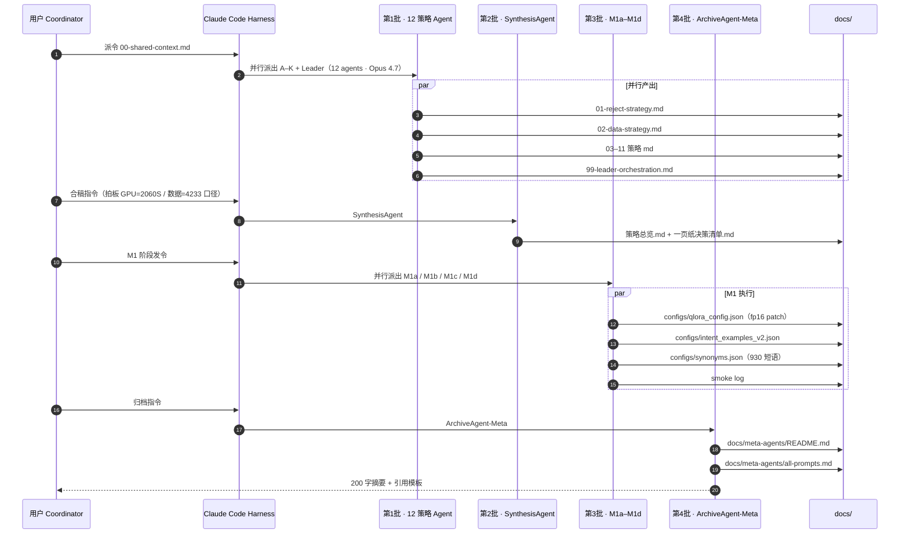

# Meta-Agents 归档索引

> 归档者：**ArchiveAgent-Meta**（Opus 4.7）
> 归档时间：2026-04-22
> 目的：为论文《AI Contribution Statement》章节提供可追溯的证据链，记录本项目开发阶段 Coordinator 实际派出的 18 个元 agent 的分工、prompt 结构与产出。

---

## 1. 概念区分：Meta-Agent vs System-Agent

本项目涉及**两类**完全不同的"agent"，必须区分：

| 维度 | **Meta-Agent（本文档范围）** | **System-Agent（`prompts/` 目录）** |
|------|------------------------------|-------------------------------------|
| 运行时期 | **开发阶段**一次性派出 | **运行时**每次用户 query 触发 |
| 宿主 | Claude Code harness（Opus 4.7） | 项目后端 FastAPI 进程内调用 Qwen2.5-1.5B + LoRA |
| 使命 | 加速方案设计、代码生成、文档合稿 | 意图路由、Query 改写、检索生成、引证校验 |
| 是否进论文 | 仅在 AI Contribution Statement 引用 | 作为核心技术资产、系统架构主体写进正文 |
| 用户可见性 | 用户完全看不见 | 用户每次提问都会触发 |
| 代表 | StrategyAgent-A..K / LeaderAgent / Synthesis / M1a–M1d | Planner / Rewriter / Responder / Validator |

**简而言之**：Meta-Agent 是"幕后的外部大脑"，System-Agent 是"产品里的内部智能角色"。本文档只记录前者，后者见 `prompts/` 与 `src/csrc_rag/orchestration/`。

---

## 2. 18 个 Meta-Agent 清单

| # | 批次 | 名字 | 模型 | 职责（一句话） | 产出文件 | 状态 |
|---|------|------|------|----------------|----------|------|
| 1 | 第 1 批 | StrategyAgent-A（拒答） | Opus 4.7 | 7 类意图 + 4 级兜底拒答策略 | `docs/strategies/01-reject-strategy.md` | ✅ |
| 2 | 第 1 批 | StrategyAgent-B（数据） | Opus 4.7 | 两级索引 + EventID+时间三切 | `docs/strategies/02-data-strategy.md` | ✅ |
| 3 | 第 1 批 | StrategyAgent-C（Query 改写） | Opus 4.7 | 共指消解 + 同义词分级 + 槽位 | `docs/strategies/03-query-rewrite-strategy.md` | ✅ |
| 4 | 第 1 批 | StrategyAgent-D（Planner 训练） | Opus 4.7 | MiniLM+LR 意图分类训练方案 | `docs/strategies/04-planner-training-strategy.md` | ✅ |
| 5 | 第 1 批 | StrategyAgent-E（检索） | Opus 4.7 | BM25⊕bge-dense+RRF 根因 5 修 | `docs/strategies/05-retrieval-strategy.md` | ✅ |
| 6 | 第 1 批 | StrategyAgent-F（重排） | Opus 4.7 | bge-reranker-v2-m3 + 业务加权 | `docs/strategies/06-reranking-strategy.md` | ✅ |
| 7 | 第 1 批 | StrategyAgent-G（回复） | Opus 4.7 | 四意图 Prompt + L7 引证校验 | `docs/strategies/07-response-strategy.md` | ✅ |
| 8 | 第 1 批 | StrategyAgent-H（QLoRA 训练） | Opus 4.7 | Qwen2.5-1.5B + QLoRA 超参 + 数据 | `docs/strategies/08-response-training-strategy.md` | ✅ |
| 9 | 第 1 批 | StrategyAgent-I（评估） | Opus 4.7 | 三级评估 + 7 组消融 + 50 条金标 | `docs/strategies/09-evaluation-strategy.md` | ✅ |
| 10 | 第 1 批 | StrategyAgent-J（模型选型） | Opus 4.7 | 六模型家族对比矩阵 + 最终选型 | `docs/strategies/10-model-selection.md` | ✅ |
| 11 | 第 1 批 | StrategyAgent-K（前后端工程） | Opus 4.7 | FastAPI+Pydantic+ECharts 七层可视化 | `docs/strategies/11-engineering-strategy.md` | ✅ |
| 12 | 第 1 批 | LeaderAgent（总统筹） | Opus 4.7 | 11 策略编排 + 11 条冲突裁决 + 风险 | `docs/strategies/99-leader-orchestration.md` | ✅ |
| 13 | 第 2 批 | SynthesisAgent（合稿） | Opus 4.7 | 12 份策略合并、冲突抓取、口径对齐 | `docs/strategies/策略总览.md` + `一页纸决策清单.md` | ✅ |
| 14 | 第 3 批 | M1a（工程整备） | Opus 4.7 | 路径清理 / bf16→fp16 patch / commit | （代码补丁 + git commit） | 🟡 进行中 |
| 15 | 第 3 批 | M1b（意图 v2 扩增+训练） | Opus 4.7 | 7 类×500=3500 条训练 + ≥0.92 F1 | `configs/intent_examples_v2.json` + `intent_classifier_v2.pkl` | 🟡 进行中 |
| 16 | 第 3 批 | M1c（同义词扩增） | Opus 4.7 | 60 → 930 短语，已完成 | `configs/synonyms.json` + `synonyms_stats.md` | ✅ |
| 17 | 第 3 批 | M1d（QLoRA smoke test） | Opus 4.7 | Qwen-0.5B/1.5B 本机 2060S 可行性验证 | `configs/qlora_config.json` + smoke 日志 | 🟡 进行中 |
| 18 | 第 4 批 | **ArchiveAgent-Meta（本 agent）** | Opus 4.7 | 把前 17 个 agent 归档为证据链 | `docs/meta-agents/README.md` + `all-prompts.md` | ✅ |

---

## 3. 启动时序图

---

## 4. 延伸阅读

- 每个 agent 的 Prompt 结构（精炼版）、产出资产、人工把关点 → [`all-prompts.md`](./all-prompts.md)
- AI Contribution Statement 引用模板 → [`all-prompts.md` §9](./all-prompts.md#9-ai-contribution-statement-引用模板)
- 各策略原文 → `docs/strategies/0x-*.md`
