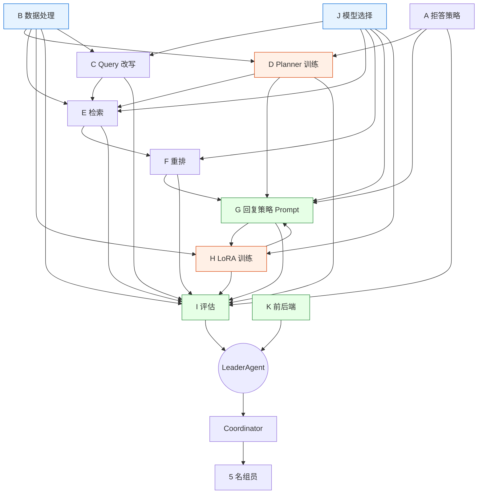
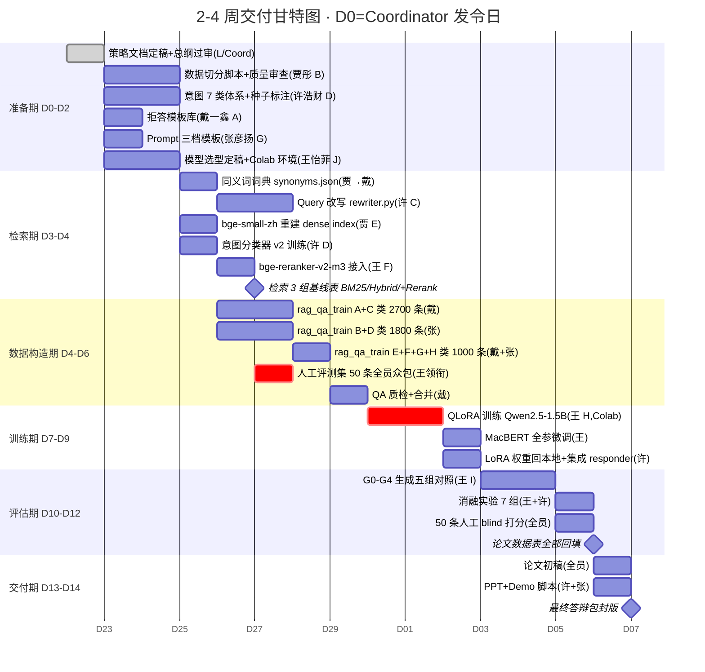

# 99 · Leader Orchestration（总统筹文档）

> 作者：**LeaderAgent**（12-Agent 团总统筹）
> 对接：Coordinator（执行员）+ 11 个策略 Agent（A–K）+ 5 名人类组员
> 目标：把"12 个 agent 并行产出的策略碎片"编织成"5 人小组 2-4 周可交付的统一作战图"
> 原则：**不写具体技术方案**，只做 **项目管理 + 依赖编排 + 风险识别 + 冲突裁决**

---

## 1. 项目目标一页纸（200 字）

**赛道 B · 独立研究**：基于 RAG 构建证监会处罚案例智能检索与问答系统。

**5 个硬约束**：
1. 必须展示 **LoRA 微调前后对比**（定量 + 样例）
2. 必须做 **幻觉缓解三组对照**（无 RAG / 有 RAG / 有 RAG+强证据约束）
3. 必须做 **≥5 组 baseline 消融**
4. 必须按 **EventID + 时间** 双重切分（防泄漏，Train 1994-2021 / Val 2022-2023 / Test 2024-2025）
5. `PunishmentMeasure` 绝不能进模型输入（泄漏标签）

**4 个交付物**：
① 8–12 页论文（含 Team Contributions + AI Contribution Statement）
② 可复现 GitHub 代码仓
③ ≤15 页答辩 PPT
④ 可离线演示的端到端 Demo

---

## 2. 12-Agent 职责矩阵

| 编号 | 名字 | 产出文件 | 负责策略层 | 上游依赖 | 下游消费者 |
|------|------|----------|------------|----------|-----------|
| L (Leader) | LeaderAgent | `99-leader-orchestration.md` | 全局统筹 | 所有 | 人类组员 / Coordinator |
| Coord | Coordinator | 合稿/发指令 | — | L | A–K |
| A | 拒答策略 | `01-reject-strategy.md` | L1 意图·拒答 | J（模型） | D、G、I |
| B | 数据处理 | `02-data-strategy.md` | L0/L4 数据 | — | D、E、H、I |
| C | Query 改写 | `03-query-rewrite-strategy.md` | L2 | B（同义词词典） | E、I |
| D | Planner 训练 | `04-planner-training-strategy.md` | L1 意图·路由 | A、B | E、G、I |
| E | 检索策略 | `05-retrieval-strategy.md` | L3 | B、C、J | F、G、I |
| F | 重排策略 | `06-reranking-strategy.md` | L3 | E、J | G、I |
| G | 回复策略 | `07-response-strategy.md` | L5/L7 | A、F、H | I |
| H | LoRA 训练 | `08-response-training-strategy.md` | L5 训练 | B、G、J | G、I |
| I | 评估策略 | `09-evaluation-strategy.md` | 横切 | 全员 | 论文作者 |
| J | 模型选择 | `10-model-selection.md` | 横切 | — | C、E、F、G、H |
| K | 前后端工程 | `11-engineering-strategy.md` | 横切交付 | E、F、G | Demo/答辩 |

**层映射（L0–L7）**：
- L0 预处理 → B
- L1 意图 → A/D
- L2 Query 改写 → C
- L3 检索+重排 → E/F
- L4 证据组装 → B/G
- L5 生成 → G/H
- L6 趋势分析 → G（轻规则）
- L7 后处理 → G

---

## 3. 依赖关系图



**关键依赖链（串行骨架）**：
`J 模型选择` → `B 数据` → `C/D/E/F` → `G prompt` → `H LoRA 训练` → `I 评估` → `K 集成 Demo`

**可并行分支**：
- A 拒答 与 B 数据 可并行
- C 改写 与 E 检索初版 可并行
- F 重排调参 与 H 训练数据构造 可并行
- I 评估集标注 与 所有模型训练 可并行

---

## 4. 组员 5 人本周任务清单（D1–D7）

### 👨‍💻 许浩财 · 架构 + 意图识别 + 系统集成（Owner of D、K）
本周 7 个任务：
1. **[D1]** 定稿 7 类意图体系（greeting/chitchat/out_of_scope/case_retrieval/law_grounding/sanction_recommendation/trend_analysis），产出 `configs/intents_v2.json`
2. **[D1-D2]** 领衔写 7×30=210 条意图种子样本，5 人众包分工
3. **[D2]** 训练 `TF-IDF+LR v2` 意图分类器，验收 Macro-F1 ≥ 0.92
4. **[D2-D3]** 负责集成 `C 改写层` 接入现有 `orchestration/` 模块
5. **[D3-D5]** 搭建统一 Pipeline Runner：意图 → 改写 → 检索 → 重排 → 生成 的串联脚本 `scripts/run_pipeline.py`
6. **[D6]** 标注 15 条 case_retrieval 人工评测集
7. **[D7]** 本周末合并 A/B/C/D/E 的 PR，做一次端到端 smoke test

### 👩‍💻 贾彤 · 数据清洗 + 向量化建库（Owner of B、E 部分）
本周 7 个任务：
1. **[D1]** 固定数据切分脚本 `scripts/split_by_event.py`（按 EventID + 时间双切）
2. **[D1-D2]** 重新校验 `event_corpus.jsonl` (4233) 和 `event_chunks.jsonl` (29314) 完整性，排查空值/超长文本
3. **[D2-D3]** 下载并部署 `bge-small-zh-v1.5`，重建 `chunk_embeddings.npy`（替换 svd_tfidf）
4. **[D3]** 整理 `configs/synonyms.json`（金融合规术语 ~200 对）交付给 C
5. **[D3-D4]** 联调 E 的 Hybrid 检索（BM25 + bge-dense + RRF），跑出新 Recall@5 基线
6. **[D4]** 产出检索 Dense vs BM25 vs Hybrid 的 3 组基线对比表
7. **[D6]** 标注 10 条 law_grounding 人工评测集

### 👨‍💻 戴一鑫 · 问答对构造 + 拒答策略（Owner of A、H 数据）
本周 7 个任务：
1. **[D1]** 定稿拒答模板库 `configs/reject_templates.json`（覆盖 chitchat/out_of_scope/低置信）
2. **[D2]** 写 300 条拒答负样本（`rag_qa_train.jsonl` 的 E 类）
3. **[D2-D3]** 整理 6 类违规分类的问法模板（类别 A 案例检索 1500 条脚手架）
4. **[D3-D5]** 主导批量生成 `rag_qa_train.jsonl` 的 A+C 类共 2700 条，含每题 3 种问法变体
5. **[D5]** 写 200 条反幻觉负样本（类别 H：虚构公司的处罚，答"未检索到"）
6. **[D6]** 标注 10 条 sanction_recommendation 人工评测集
7. **[D7]** 抽样 100 条自构 QA 做人工质检，给 H 通过率报告

### 👩‍💻 张彦扬 · 问答对构造 + Prompt 模板（Owner of G、H 数据）
本周 7 个任务：
1. **[D1]** 定稿统一 Prompt 模板 `configs/prompt_templates/*.j2`（system+user+assistant 三段式）
2. **[D2]** 写强证据约束 prompt 的 3 个版本（宽/中/严）交给 I 做消融
3. **[D2-D4]** 主导批量生成 `rag_qa_train.jsonl` 的 B+D 类共 1800 条（法条依据 1200 + 趋势 600）
4. **[D4-D5]** 构造 300 条多轮跟进对话（类别 G：含代词消解样例）
5. **[D5]** 构造 200 条问候/闲聊正样本（类别 F）
6. **[D6]** 标注 10 条 trend_analysis 人工评测集
7. **[D7]** 把 prompt 模板集成到 `responder.py`，做 G0/G1/G2 三组对照的参数预设

### 👩‍💻 王怡菲 · 模型选型 + 评估体系（Owner of J、I、F）
本周 7 个任务：
1. **[D1]** 定稿 `10-model-selection.md`：给出基座/Embedding/Reranker/分类器最终选型表
2. **[D2]** 下载并离线测通 `bge-reranker-v2-m3`，提供给 E/F
3. **[D2-D3]** 写 `09-evaluation-strategy.md`：定义全部指标代码 + 自动评测脚本骨架
4. **[D3]** 确定 QLoRA 训练环境（本机 vs Colab T4 vs Kaggle P100），给出一键脚本
5. **[D4]** 联调 F 的 bge-reranker 接入 E 的 Hybrid，产出 "+Rerank" 对比行
6. **[D6]** 标注 5 条 边界/拒答/多轮 人工评测集 + 牵头当晚组 blind 打分汇总
7. **[D7]** 产出评测 Dashboard 表格 v1（各层指标占位填入）

---

## 5. 完整 TODO 甘特图（D0–D14）



---

## 6. 里程碑 Checkpoint（6 关）

### M1 · D2 · 策略文档全过审 + 意图 7 类重训完成
- **验收标准**：
  - 01–11 号策略文档 11 份齐，每份 ≥ 500 字 + 1 张 mermaid 图
  - 意图分类器 v2 Macro-F1 ≥ 0.92（holdout 700 条）
  - `configs/synonyms.json` 至少 200 对
- **签字人**：王怡菲（I 评估）+ 许浩财（架构）
- **降级方案**：若 F1 < 0.90 → 先冻结 4 类（旧体系）保通路，7 类降为 next week backlog

### M2 · D4 · 检索质量达标（Recall@5 ≥ 0.4）
- **验收标准**：
  - 50 条 mini 评测集（每类 10 条快速版）Recall@5 ≥ 0.4、MRR ≥ 0.35
  - 3 组基线对比表产出：BM25 / Hybrid / +Rerank
- **签字人**：贾彤（数据）+ 王怡菲（评估）
- **降级方案**：若 bge-reranker 推理延迟 > 3s/query → 降级用 bge-reranker-base 或减候选到 top-20

### M3 · D6 · LoRA 训练数据 5500 条齐 + 评测集 50 条齐
- **验收标准**：
  - `rag_qa_train.jsonl` ≥ 5000 条，抽检 100 条人工质检通过率 ≥ 85%
  - `eval/gold_50.jsonl` 50 条齐备，每条含问题+金标+EventID 列表+法条列表
- **签字人**：戴一鑫（数据）+ 张彦扬（模板）
- **降级方案**：若通过率 < 75% → 启动 LLM 精修（用 DeepSeek 免费额度修答案），数据量降到 4000 条也能跑

### M4 · D10 · QLoRA 微调完成 + MacBERT 微调完成
- **验收标准**：
  - Qwen2.5-1.5B LoRA 权重在 val 集上相较原始 Qwen 在 BERTScore-F1 上提升 ≥ 3 个百分点
  - MacBERT Macro-F1 相较 TF-IDF 提升 ≥ 5 个百分点
- **签字人**：王怡菲（模型+评估）
- **降级方案**：若 LoRA 收益 < 1% → 降级为 Qwen2.5-0.5B + LoRA（论文如实记录资源限制）；若 Colab 超时 → 切 Kaggle P100

### M5 · D12 · 所有消融 + 论文数据齐
- **验收标准**：
  - 7 组消融对比表齐全（BM25/Dense/Hybrid、+Rerank、改写、metadata 过滤、LoRA、Prompt 约束、top-k）
  - 50 条人工 blind 打分录入完成
- **签字人**：王怡菲 + 张彦扬
- **降级方案**：消融至少 5 组（课程底线），砍掉 chunk 大小和 "仅 Activity vs Activity+Law" 两项

### M6 · D14 · 论文 + PPT + Demo 全交付
- **验收标准**：
  - 论文 8–12 页 PDF，含 Team Contributions + AI Contribution Statement
  - PPT ≤ 15 页，答辩流程 5–8 分钟
  - Demo 必须能**离线**演示 1 条真实样例全链路
- **签字人**：许浩财（集成）+ 全员共签
- **降级方案**：Demo 现场无网 → 提前录屏 + 离线 FAISS 包兜底

---

## 7. 风险登记册（按 可能性 × 影响 排序）

| 编号 | 风险 | 可能性 | 影响 | 总分 | 缓解措施 | 责任人 |
|------|------|--------|------|------|---------|--------|
| R1 | 本机无 GPU，QLoRA 必须上 Colab/Kaggle | 高 | 高 | 9 | D1 就把 Colab 账号、HF token、数据集 zip 打包好；同时备 Kaggle；写断点续训脚本 | 王怡菲 |
| R2 | 人工评测集 50 条标注质量参差 | 高 | 高 | 9 | 一次性组织线下标注 2h；王怡菲做交叉检查 20%；每类至少 5 人共识 | 王怡菲 |
| R3 | LoRA 训练数据模板化导致过拟合模板句式 | 高 | 中 | 6 | 每题 3 种问法变体；G 类多轮跟进；H 类反幻觉负样本 300+；val 上做早停 | 戴一鑫/张彦扬 |
| R4 | 答辩 Demo 现场网络不稳 | 中 | 高 | 6 | 必须能离线跑；预录 3 条示范录屏；本地装好所有权重 | 许浩财 |
| R5 | 开题 8000 vs 实际 4233 数据口径不一致 | 高 | 低 | 3 | 论文统一写"14740 原始 → 4233 事件 + 14740 当事人"，不再提 8000 | 贾彤 |
| R6 | 5 人不同机器 git 冲突（特别是 configs/ 和 data/processed/） | 中 | 中 | 4 | 每人一个 feature 分支；data/processed 交给贾彤统一维护；configs/ 拆细文件 | 许浩财 |
| R7 | bge-reranker 推理延迟太高导致 Demo 卡顿 | 中 | 中 | 4 | 预先压缩候选到 20；缓存 query 结果；Demo 用 7 条 pre-baked 问题 | 王怡菲 |
| R8 | 幻觉率指标没有自动化方案，只能人工标 | 中 | 高 | 6 | I 评估脚本必须自动判断"答案中的 EventID 是否在检索 top-k 内"；法条用正则校验 | 王怡菲 |
| R9 | Qwen2.5-1.5B 基座中文指令遵循不够 | 低 | 高 | 3 | 备选 Qwen2.5-3B-Instruct；若仍不行退到 GPT-4 API + RAG 做 G4 上限对照 | 王怡菲 |
| R10 | 时间节奏 D6 评测集卡壳 → 整个训练期延后 | 中 | 高 | 6 | 评测集候选题目 D4 就准备好，D6 当晚 2h 冲完；必要时降到 40 条 | 王怡菲 |
| R11 | 策略文档(01-11)有 6 份尚未入库，agent 可能跳票 | 高 | 高 | 9 | Coord 每日 check；D2 前未交者降级走默认方案，不阻塞主干 | Coordinator |
| R12 | 反幻觉负样本量不够，模型依然编造法条 | 中 | 高 | 6 | H 类负样本增加到 300；Prompt 加"未检索到充分证据"兜底；L7 引证校验硬拦截 | 戴一鑫 |

**Top-3 最紧急（9 分）**：R1（Colab 环境）、R2（评测集质量）、R11（策略文档跳票）→ 本周必须消除。

---

## 8. 冲突裁决清单（11 Agent 之间可能撞车的点）

| # | 冲突点 | 双方立场 | 裁决 |
|---|--------|----------|------|
| C1 | E（检索）希望 chunk 短便于精排 vs H（LoRA）希望 context 长 | E 要 chunk 150 字，H 要 context 4K | **chunk 300–500 字 + top_k=5–8，context 控制在 2048 token** |
| C2 | A（拒答）想把"保险违规"拒掉 vs B（数据）发现数据含保险类 | A 要域外全拒，B 要保留 | **只拒"完全无证监会案例"的域外；保险类若数据有，则走 RAG 但标注"非证券场景，仅供参考"** |
| C3 | H（训练）推 Qwen2.5-1.5B vs J（选型）可能推 Qwen2.5-3B | 1.5B 显存友好，3B 效果更好 | **默认 1.5B（Colab T4 16G 稳）；若 QLoRA 4-bit 下 3B 也能跑且不超时，J 可升级；权重兼容层在 configs/models.json** |
| C4 | C（改写）希望同义词尽量扩 vs E（检索）担心过度扩词 noise | C 要 OR 所有同义词，E 要选择性扩 | **同义词分两级：强同义词（无脑 OR）+ 弱同义词（带权重 0.3）；E 用 BM25 加权查询** |
| C5 | D（Planner）希望意图 10+ 类细分 vs A（拒答）要 7 类够用 | D 要细分检索子类，A 要简化 | **对外 7 类，内部 case_retrieval 下分 3 个子意图（案例查找/相似案例/机构类），D 产出双层标签** |
| C6 | F（重排）要 top-k 留 8 给生成 vs G（回复）担心 context 过长 | F 要 8，G 要 5 | **默认 top_k=5，消融实验测 3/5/8；超长证据做 summarize 压缩** |
| C7 | B（数据）希望切分脚本用随机 vs I（评估）要严格时间切 | B 担心时间切导致数据分布不均，I 要防泄漏 | **按 EventID + 时间双切（Train 1994-2021 / Val 2022-2023 / Test 2024-2025）；I 额外保留 20% 随机切做 sanity check** |
| C8 | K（工程）想前端用 ECharts 画趋势图 vs G（回复）担心趋势分析不稳 | K 要好看，G 要保守 | **trend_analysis 先出表格 + 柱状图（固定模板），复杂图放 v2** |
| C9 | H（训练）想 epoch=3 vs J（选型）担心过拟合 | H 要 3 轮，J 要早停 | **3 epoch + val-loss 早停，patience=2；保存每 epoch checkpoint 便于对比** |
| C10 | I（评估）要所有 agent 提交指标代码 vs 各 agent 只愿给数字 | I 要复现性，agents 要赶进度 | **I 提供统一评测 SDK（基类 + 接口），各 agent 只实现 compute() 方法；截止 D7** |
| C11 | G（回复）强证据 prompt 会降低回复自然度 vs A（拒答）要严格约束 | G 要平衡，A 要硬约束 | **Prompt 三档：宽/中/严；G3（LoRA+严格）作为最终提交；消融实验展示 Prompt 严格程度对幻觉率的影响** |

---

## 9. 下一步行动（给 Coordinator）

### 🔴 3 件用户必须立刻拍板
1. **Q4（算力）**：用户本机显卡型号？若无独立 GPU/显存<8GB → 立刻确定用 Colab T4 还是 Kaggle P100，账号归属哪位组员
2. **M3 评测集组织时间**：必须锁定 D6（按甘特图约 4/27 晚）线下 2h 全员标注会议时间
3. **论文口径确认**：开题报告的"8000 条"口径是否改写为"14740→4233 事件+14740 当事人"？这关系到论文 3.1 节

### 🟢 5 件 Coordinator 我可立刻启动
1. **催齐策略文档**：02/04/05/08/09/11 号文档当前未入库，Coord 立刻 @ 对应 agent，截止 D2 12:00
2. **创建 feature 分支**：为 5 名组员各开一个分支（`feat/intent-v2`、`feat/bge-index`、`feat/qa-data-dai`、`feat/prompt-zhang`、`feat/eval-wang`）
3. **建立每日站会**：D1 起每天 20 分钟简报，各 agent/组员报阻塞；用 GitHub Issue 或群文档
4. **准备 Colab 训练包**：把 `src/csrc_rag/training` + `rag_qa_train.jsonl` 骨架 + 一键脚本打 zip，供 D7 直接上传
5. **启动 50 条评测集候选题目**：让 Coord 基于 `event_corpus.jsonl` 先抽 100 条候选给 5 人挑，减少 D6 当晚工作量

### 🟡 2 件等到下周（D8–D14）
1. **论文章节分配与写作模板**：D10 后再讨论，避免过早分工
2. **辅线 MacBERT 是否保留**：看 M4 主线 LoRA 跑完时间，有富余才做

### 📊 总体时间判断：**🟡 黄灯**（可行，但有明确瓶颈）
- **绿色项**：数据、检索、前端工程（代码底子已有，均为增量改造）
- **黄色项**：LoRA 训练（取决于 Colab 配额与 R1 解决速度）、人工评测集（质量风险 R2、R10）
- **红色项**：策略文档 6 份未交（R11）→ **48 小时内必须全部入库**

**结论**：若 R1/R2/R11 三项在 D2 前全部缓解，则 D14 交付 **可达** 80%；否则建议向授课老师申请 +2 天到 D16（仍在 4 周内）。

---

## 附录 A · 每日负责人看板（冰箱贴版）

```
D0 今天  → Coord 发令，Leader 文档过审
D1 明天  → 策略文档定稿、种子样本 210 条、同义词 200 对、模型选型定稿
D2      → 意图 v2 模型训完（Macro-F1≥0.92）  ⭐ M1
D3      → bge-dense 重建、改写层合并
D4      → 检索 3 组对比表出炉                ⭐ M2
D5      → rag_qa_train.jsonl 5500 条齐
D6      → 评测集 50 条齐                      ⭐ M3（晚会议）
D7      → 端到端 smoke test 全链路跑通
D8-9    → Colab QLoRA 训练 + MacBERT 微调
D10     → LoRA 权重回本地集成               ⭐ M4
D11     → G0-G4 五组对照 + 50 条 blind 打分
D12     → 消融 7 组数据齐                    ⭐ M5
D13     → 论文初稿
D14     → PPT + Demo 封版                    ⭐ M6
```

---

> **Leader 最后一句**：这个项目 5 人 2-4 周完全够，瓶颈不在技术，而在 **策略文档交齐 + 评测集标注质量 + Colab 配额**。三件事搞定，其他都是执行问题。Coord 请按 §9 红/绿/黄三档立刻推动。
