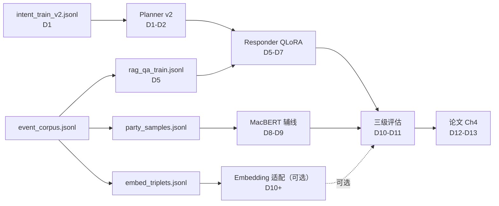

# Training Agents · 本项目所有要训练的 Agent 统一清单

> Owner: TrainingManifestAgent · 归属赛道 B（深度学习大作业）
> 目的：一页纸看完"项目里到底要训几个 Agent、谁必训、谁不训、训多久、用什么卡、落哪个 artifact"。
> 上游：`docs/微调方案.md`、`docs/strategies/04-planner-training-strategy.md`、`docs/strategies/08-response-training-strategy.md`、`docs/strategies/09-evaluation-strategy.md`
> 下游：各个训练 Agent（下游 D-Agent）、评估 Agent（I-Agent）、论文写作 Agent

---

## 1. 一页纸训练矩阵（核心表格）

7 个系统 Agent，其中 **4 个必训 / 1 个可选 / 2 个不训（规则或 few-shot 复用）**。

| # | Agent 名称 | 是否必训 | 训练类型 | 基座模型 | 训练数据 | 数据量 | 训练环境 | 输出 artifact | 负责时段 | 评估指标 | 目标值 |
|---|---|---|---|---|---|---|---|---|---|---|---|
| 1 | Planner v2（意图分类） | **必训** | 监督分类（单标签 7 类） | TF-IDF+LR 起步 / FastText 主路线 / DistilBERT-zh 消融 | `data/intent/intent_train_v2.jsonl` | 3500（7 类 × 500） | 本机 CPU（全部） | `artifacts/intent_classifier_v2/intent_model_v2.pkl` + `intent_report_v2.json` | D1–D2 | Accuracy / Macro-F1 / 混淆矩阵 | Macro-F1 ≥ 0.92（主路线 FastText） |
| 2 | Rewriter（共指消解 + 槽位抽取） | **不训**（few-shot） | 复用 L5 Qwen 推理 | — | 规则引擎 + 2–6 条 few-shot 例子 + `configs/synonyms.json` | 4–6 条 shot + 200+ 同义词 | 推理时共享 L5 LoRA 模型显存 | `prompts/rewriter/*.j2` + `configs/synonyms.json` | —（数据建设 D3） | 共指消解准确率 / 槽位 F1 | 共指 ≥ 0.85 / 槽位 micro-F1 ≥ 0.80 |
| 3 | **Responder (QLoRA 主战)** | **必训** | **PEFT / QLoRA（4-bit NF4 + r=16）** | Qwen2.5-1.5B-Instruct（兜底 0.5B） | `data/train/rag_qa_train.jsonl`（A/B/C/D/E/F/G/H 八类） | 5500（train 5000 / val 300 / test 200） | **本机 RTX 2060S 8GB fp16（主训）** 或 **Colab T4 16GB bf16（备选）** / Kaggle P100 | `artifacts/models/qwen_lora_csrc/adapter_model.safetensors`（~40 MB） | D5–D7 | ROUGE-L / BERTScore / 引证命中率 / 幻觉率 | ROUGE-L ≥ 0.45 / 幻觉率 ≤ 5% / 引证命中率 ≥ 0.85 |
| 4 | PunishmentType Classifier（辅线） | **必训** | 全参微调（多标签分类） | `hfl/chinese-macbert-base` | `data/processed/party_samples.jsonl`（不含 PunishmentMeasure 字段） | 14740（按时间三分） | 本机 RTX 2060S fp16 / Colab | `artifacts/punishment_macbert/` | D8–D9 | Micro-F1 / Macro-F1 / Hamming / Subset Acc | Macro-F1 ≥ 0.35（相对 TF-IDF baseline 0.2759 提升）/ Micro-F1 ≥ 0.70 |
| 5 | Embedding 领域适配（可选） | **可略** | 对比学习（triplet / InfoNCE） | `BAAI/bge-small-zh-v1.5` | 事件级正负例对 | ~10000 pair | Colab T4 | `artifacts/bge_zh_csrc/` | D10+ | Recall@5 提升 | +5pp over 原始 bge-small |
| 6 | Validator（引证校验） | **不训**（规则） | — | — | — | — | — | `prompts/validator/rules.yaml`（regex + 集合比对） | — | 误报率 | ≤ 3% |
| 7 | TrendAnalyzer（趋势分析） | **不训**（聚合 + 可选 LLM 解释） | — | — | groupby(year/violation/agency) | — | — | `prompts/trend_analyzer/*.yaml` | — | — | — |

> **统计**：7 个中 4 必训（Planner / Responder / MacBERT / 可选 Embedding）、1 个 few-shot 复用（Rewriter）、2 个纯规则/聚合（Validator / TrendAnalyzer）。

---

## 2. 必训 Agent 展开卡片（共 4 张）

### 卡片 1 · Planner v2（7 类意图分类）

- **目标**：把当前 TF-IDF+LR 4 类 baseline 升级为 7 类查询路径规划器，为 L2~L5 产出完整 `QueryPlan` JSON。
- **数据源**：
  - 种子 21 条来自 `configs/intent_examples_v2.json`；
  - LLM 扩增到每类 500 条（通用 Prompt 见 04 策略 §5）；
  - 字段 = `{text: str, intent: str, meta: {source, seed_id}}`。
- **数据构造脚本**：`scripts/build_intent_train_v2.py`（已存在）产出 `data/intent/intent_train_v2.jsonl`。
- **训练脚本**：`scripts/train_intent_classifier_v2.py --backend {sklearn,fasttext,bert}`（已存在，三路线切换）。
- **超参完整 JSON**（写入 `configs/intent_classifier_v2.json`，可拷贝）：
  ```json
  {
    "backend": "fasttext",
    "sklearn": {"ngram_range": [1, 3], "analyzer": "char_wb", "min_df": 2, "max_df": 0.95, "C": 4.0, "class_weight": "balanced"},
    "fasttext": {"dim": 128, "epoch": 25, "lr": 0.5, "wordNgrams": 2, "minn": 2, "maxn": 5, "loss": "softmax"},
    "bert": {"model_name": "hfl/chinese-distilbert-base", "max_length": 64, "batch_size": 32, "lr": 2e-5, "epochs": 4},
    "split_ratio": [0.7, 0.15, 0.15],
    "seed": 42
  }
  ```
- **训练命令**：
  - 本机（CPU，<30s）：`python scripts/train_intent_classifier_v2.py --backend fasttext`
  - Colab（消融用 DistilBERT）：在 `notebooks/planner_distilbert_colab.ipynb`（待建）运行同一脚本 `--backend bert`。
- **训练时长估计**：
  - sklearn 路线：本机 CPU < 10s
  - fasttext 路线：本机 CPU < 30s
  - DistilBERT 路线：T4 bf16 ≈ 5–15 min / P100 fp16 ≈ 4–12 min / 2060S fp16 ≈ 8–18 min
- **验收标准**：Macro-F1 ≥ 0.92 且 `out_of_scope` Recall ≥ 0.95；低于该线时 **回退到 TF-IDF 4 类 v1 模型**。
- **集成位置**：`src/csrc_rag/orchestration/planner.py` 的 `Planner.predict(query) -> QueryPlan`（由 Coordinator 阶段接入，读 `configs/intents.json` 合并 retrieval_mode / filters / top_k 字段）。

### 卡片 2 · **Responder (QLoRA 主战)**

- **目标**：让 1.5B 基座学会"按 EventID/法条引证、越界拒答、证据不足说'不足'、保持 responder 模板格式"，同时满足赛道 B 的微调前后对比硬性要求。
- **数据源详细说明**：
  - 从 `data/processed/event_corpus.jsonl`（4233 事件）的 Activity / Party / Law / DeclareDate 字段构造 A/B/D 类；
  - 从 `data/processed/party_samples.jsonl`（14740 当事人）结合 PunishmentType / SumPenalty 构造 C 类（**PunishmentMeasure 只准进 output，不进 input**，防泄漏）；
  - E/F/G/H 四类走手写种子 + 模板扩写（见 08 策略 §3）。
  - 字段 = `{id, system, history, instruction, input, output, category, sample_weight}`。
- **数据构造脚本**：`scripts/build_rag_qa_train.py`（已存在）产出 `data/train/rag_qa_{train,val,test}.jsonl`（按 EventID+时间切，2024/2025 事件进 test）。
- **训练脚本**：`scripts/train_qlora_qwen.py`（已存在）；支持 `--ablation v1|v2|v3` 消融、`--resume_from_checkpoint`。
- **超参完整 JSON**：直接引用 `configs/qlora_config.json`（H-Agent 已落盘，已 patch `bf16→fp16` fallback）。关键字段摘录：
  ```jsonc
  {
    "quantization": {"load_in_4bit": true, "bnb_4bit_quant_type": "nf4", "bnb_4bit_use_double_quant": true, "bnb_4bit_compute_dtype": "bfloat16"},
    "lora": {"r": 16, "lora_alpha": 32, "lora_dropout": 0.05, "target_modules": ["q_proj","k_proj","v_proj","o_proj","gate_proj","up_proj","down_proj"]},
    "training": {"per_device_train_batch_size": 4, "gradient_accumulation_steps": 4, "learning_rate": 2e-4, "num_train_epochs": 3, "max_seq_length": 2048, "warmup_ratio": 0.03, "lr_scheduler_type": "cosine", "optim": "paged_adamw_8bit", "gradient_checkpointing": true, "bf16": true, "fp16_fallback": true},
    "early_stopping": {"patience": 3, "min_delta": 0.005}
  }
  ```
- **训练命令 · 本机 RTX 2060S fp16 vs Colab T4 bf16 完整对比**：

  | 维度 | 本机 RTX 2060S 8GB | Colab T4 16GB |
  |---|---|---|
  | compute_dtype | **fp16**（Turing 不支持 bf16） | **bf16**（Ampere/Turing T4 原生 bf16 可用） |
  | per_device_train_batch_size | **2** | 4 |
  | gradient_accumulation_steps | **8**（保持有效 batch=16） | 4 |
  | gradient_checkpointing | True | True |
  | 预计 step 时长 | ~0.55 s/step | ~0.10 s/step |
  | 总耗时（~1030 step） | **~9.5 h**（不挂起可连夜训，稳定） | **2.5–3.5 h** |
  | 主用风险 | 显存 7.5/8 GB 贴脸，需关掉浏览器/其他 CUDA 进程 | Colab 可能掉线 → 需 `--resume_from_checkpoint` |
  | 命令 | `python scripts/train_qlora_qwen.py --config configs/qlora_config.json --override compute_dtype=float16 per_device_train_batch_size=2 gradient_accumulation_steps=8` | 打开 `notebooks/qwen_qlora_colab.ipynb` → Runtime=T4 → 直接 `Run All` |

- **训练时长估计**：2060S fp16 ≈ **9–10 h**（一个通宵）；T4 bf16 ≈ **2.5–3.5 h**；P100 fp16 ≈ **2.0–2.5 h**；A100 40GB ≈ **0.6 h**。
- **验收标准**：
  - **通过**：相对 G2（1.5B + RAG + 强约束 prompt）在 ROUGE-L / BERTScore / 引证命中率 / 幻觉率 ≥ 3 项正向；幻觉率绝对下降 ≥ 5pp。
  - **回退方案**：若 2060S 反复 OOM 或 loss 不收敛 → 降级 `Qwen/Qwen2.5-0.5B-Instruct` 重跑，论文 Ch4 说明"本机资源限制下选用 0.5B 以保证可复现"。
- **集成位置**：`src/csrc_rag/response/responder.py` 的 `LocalHFResponder._ensure_model()` 末尾增加 3 行 PEFT 挂载（`PeftModel.from_pretrained(...).merge_and_unload()`），`configs/models.json` 的 `response_generation.lora_adapter` 指向 `artifacts/models/qwen_lora_csrc`。

### 卡片 3 · PunishmentType Classifier（辅线 · MacBERT 全参微调）

- **目标**：作为"监督任务微调前后对比"的论文证据；在多标签分类场景下相对 TF-IDF baseline 提升 Macro-F1。
- **数据源**：`data/processed/party_samples.jsonl`（14740 条当事人样本），按时间三分（Train 1994–2021 / Val 2022–2023 / Test 2024–2025），特征字段 = `Activity + Industry + Party + Position`，标签 = `PunishmentType` multi-hot。**严禁把 `PunishmentMeasure` 作为输入**（已知泄漏坑，baseline 就是被它拉到 0.86 虚高的）。
- **数据构造脚本**：已由 `src/csrc_rag/training/data.py::load_party_samples` + `time_split` 完成，无需新脚本。
- **训练脚本**：`scripts/train_punishment_finetune.py`（已存在）。
- **超参完整 JSON**（写入/复用 `configs/models.json::fine_tuning`）：
  ```json
  {
    "transformer_model": "hfl/chinese-macbert-base",
    "max_length": 256,
    "batch_size": 16,
    "learning_rate": 2e-5,
    "num_train_epochs": 4,
    "weight_decay": 0.01,
    "warmup_ratio": 0.1,
    "fp16": true,
    "threshold": 0.5,
    "seed": 42
  }
  ```
- **训练命令**：
  - 本机 2060S fp16：`python scripts/train_punishment_finetune.py --output-dir artifacts/punishment_macbert --batch-size 8`（显存 8GB 要把 batch 降到 8，`max_length=256` 时 4–8 皆可）
  - Colab T4 bf16：对应 `notebooks/macbert_punishment_colab.ipynb`（待建），命令相同。
- **训练时长估计**：2060S fp16 ≈ 2–3 h（14740×4 epoch）/ T4 bf16 ≈ 50–80 min / P100 fp16 ≈ 40–60 min。
- **验收标准**：
  - **通过**：Macro-F1 ≥ 0.35（相对 baseline 0.2759）；Micro-F1 ≥ 0.70；HammingLoss 相对 baseline 下降。
  - **回退方案**：若 MacBERT Macro-F1 反而不升，报告为"小样本类长尾问题"，把 TF-IDF baseline 作为主结果写进论文（不算失败，课程要求的是"做了对比"不是"必须赢")。
- **集成位置**：`src/csrc_rag/orchestration/punishment_predictor.py`（预测器适配层）；线上 inference 在 Responder 侧作为 C 类问题的辅助证据注入 prompt。

### 卡片 4 · Embedding 领域适配（可选 · bge-small-zh 对比学习）

- **目标**：让检索层 Recall@5 相对 `BAAI/bge-small-zh-v1.5` 原版再涨 5pp；作为 A1 消融实验里 "Dense-adapted" 那一组。
- **数据源**：由 `event_corpus.jsonl` 构造（query, positive_event, hard_negative）三元组，hard negative 从同 ViolationType 不同年份/同年份不同 Party 的事件里采样。
- **数据构造脚本**：`scripts/build_embedding_triplets.py`（待建）产出 `data/train/embed_triplets.jsonl`，~10000 triplet。
- **训练脚本**：`scripts/train_bge_contrastive.py`（待建），用 `sentence-transformers` 的 `MultipleNegativesRankingLoss`。
- **超参完整 JSON**：
  ```json
  {
    "base_model": "BAAI/bge-small-zh-v1.5",
    "max_seq_length": 256,
    "batch_size": 32,
    "num_epochs": 2,
    "warmup_steps": 100,
    "learning_rate": 2e-5,
    "loss": "MultipleNegativesRankingLoss",
    "fp16": true
  }
  ```
- **训练命令**：本项目优先 Colab T4（bf16，2060S 显存紧 prefer Responder 独占）。`notebooks/bge_finetune_colab.ipynb`（待建）。
- **训练时长估计**：T4 bf16 ≈ 40–60 min / P100 fp16 ≈ 30–45 min。
- **验收标准**：Recall@5 相对原版 bge-small-zh +5pp 视为通过；不达标则直接保留原版 bge-small-zh，论文 Ch4 说明"领域数据量 1 万 triplet 不足以撼动已在中文大规模语料上预训的 bge"。
- **集成位置**：`src/csrc_rag/retrieval/dense.py` 的 `DenseEncoder.from_config()` 读 `configs/retrieval.json::embedding.model_path` 切到 `artifacts/bge_zh_csrc`。

---

## 3. 训练顺序和依赖图（Mermaid）



关键依赖说明：
1. **Planner 先行**：Planner 的 `intent` 字段决定 Responder 训练数据构造时的模板分支（A/B/C/D 各类），因此 D1–D2 必须先跑通。
2. **Responder 中段主战**：D5–D7 独占 2060S（通宵训）或 Colab T4。
3. **MacBERT 接 Responder 后**：MacBERT 可用 Responder 训完后的空闲时段，或直接 Colab 并行。
4. **评估在最后**：D10–D11 合并所有 artifact 跑 L1/L2/L3 三级评估。

---

## 4. 训练数据构造的统一原则（所有训练 Agent 必须遵守）

- **时间三分**：所有数据按 `EventID` + `DeclareDate` 切分为 **Train 1994–2021 / Val 2022–2023 / Test 2024–2025**；严禁随机切，防泄漏。
- **标签泄漏红线**：`PunishmentMeasure` 字段**不得进入任何分类任务的输入**（只能进 Responder 的 output 端），因为它本质上就是答案。
- **`_meta` 字段强制**：每个训练数据集必须在 JSONL 同目录加 `_meta.json`，记录：
  ```json
  {"generated_at": "2026-04-22T10:00:00+08:00", "script_version": "build_rag_qa_train.py@abcdef1", "seed_sources": ["event_corpus.jsonl@v1.2", "party_samples.jsonl@v1.2"], "split_strategy": "event_id_hash + declare_date", "seed": 42, "checksum_sha256": "..."}
  ```
- **不 commit 数据**：`data/train/*.jsonl`、`data/intent/*.jsonl`、`data/eval/*.jsonl` 一律进 `.gitignore`；只 commit 构造脚本 + `_meta.json` + 样本 checksum。
- **扩增 Prompt 统一禁止**：禁止在扩增样本里出现真实人名 / 机构名 / 股票代码；禁止出现 PunishmentMeasure 具体金额。
- **人工抽检**：每类抽 6% 由 Coordinator 复核标签（Planner）或 StrategyAgent-I 复核（Responder）。

---

## 5. 训练环境清单

| 环境 | 适用 Agent | 备注 |
|---|---|---|
| 本机 Windows 3.12 + CPU | Planner v2（sklearn/fasttext）/ 所有数据构造脚本 / smoke test | sklearn + fasttext 已装；无需 GPU；训练 < 1 min |
| 本机 Windows 3.12 + RTX 2060S 8GB | **Responder QLoRA fp16（主训）** / MacBERT 全参微调 fp16 | **必须先装 cu121 torch**（`pip install torch==2.3.1+cu121 --index-url https://download.pytorch.org/whl/cu121`）；bnb 0.43+；Turing 架构不支持 bf16，`qlora_config.json` 的 `fp16_fallback: true` 会自动切 fp16 |
| Colab T4 16GB | Responder QLoRA bf16（备选） / DistilBERT-zh Planner 消融 / Embedding 对比学习 | `notebooks/qwen_qlora_colab.ipynb` 已就位；free tier 断连风险高 → 全部走 `--resume_from_checkpoint` |
| Kaggle P100 16GB | 同 Colab（备选） | P100 比 T4 快 ~1.3×，免费 30h/周；适合需要长跑的 Embedding 对比学习 |

**选卡优先级（Responder）**：Colab T4 > 本机 2060S > Kaggle P100 > 降级 0.5B。Colab 断线兜底 Kaggle；本机训则需提前把开发工具/浏览器全关。

---

## 6. 失败兜底（训崩了怎么办）

| Agent | 失败场景 | 兜底方案 |
|---|---|---|
| Planner v2 | Macro-F1 < 0.85 | 回退到 `scripts/train_intent_classifier.py` 的 TF-IDF 4 类 v1 模型，`configs/intents.json` 降级为 4 类映射，前端不受影响 |
| Planner v2 | `out_of_scope` Recall < 0.95 | 叠加 `src/csrc_rag/orchestration/topic_guard.py` 关键词前置拦截作为第二道闸，再跑一次评估 |
| Responder QLoRA | 本机 2060S 显存 OOM | 先降 `per_device_train_batch_size=1` + `grad_accum=16`；仍 OOM 则切 `Qwen2.5-0.5B-Instruct`；论文 Ch4 注明"本机资源限制" |
| Responder QLoRA | Colab 断连 | `--resume_from_checkpoint artifacts/models/qwen_lora_csrc/checkpoint-xxx` 接续；或切 Kaggle P100 |
| Responder QLoRA | val_loss 连续 3 次上升 | EarlyStoppingCallback 自动回滚到 `best_eval_loss` checkpoint（已配置 patience=3） |
| Responder QLoRA | V3 幻觉率反而高于 V2 | 退回 V2 adapter 作为主结果，论文 Ch4 把 V3 作为"数据加 H 反而过拟合"消融负证据 |
| MacBERT | Macro-F1 不升反降 | 回退 TF-IDF baseline 作为 L1 主结果；MacBERT 作为"监督任务全参微调对比"消融负证据写论文 |
| MacBERT | 显存 OOM | batch_size 从 16 降到 8 或 4；max_length 从 256 降到 192 |
| Embedding 适配 | Recall@5 不升 | 直接保留 `bge-small-zh-v1.5` 原版；本 Agent 标为"尝试过但收益不显著" |

---

## 7. 与论文章节对应（给未来的自己）

| 本文档内容 | 对应论文章节 | 用途 |
|---|---|---|
| 表 1（训练矩阵） | Ch3.2 系统架构 · 训练 Agent 全景图 | 一页说明"我们训了哪些、没训哪些、为什么" |
| 卡片 2（Responder QLoRA） | **Ch3.3 微调方法 + Ch4.2 微调前后对比（主战）** | 赛道 B "模型微调 10 分 + baseline 对比 10 分" 的直接支撑 |
| 卡片 2 消融（V1/V2/V3） | Ch4.2 消融实验 | 覆盖 7 组消融中的 3 组（数据规模 × 模板 × 反幻觉负样本） |
| 卡片 3（MacBERT） | **Ch4.3 监督任务微调对比** | PEFT 之外的"全参微调"对比样本 |
| 卡片 1（Planner） | Ch3.1 意图识别 + 附录 A 三路线对比 | 凑齐"TF-IDF / FastText / DistilBERT 三路线" 消融 ≥ 5 组的其中一组 |
| 卡片 4（Embedding 适配） | Ch4.4 检索增强消融（可选） | 检索链路的 A1 消融补强 |
| §4 数据构造原则 | Ch3.4 数据工程 | 证明"我们有防泄漏切分、有 `_meta` 追溯" |
| §6 失败兜底 | Ch5 讨论 / Limitations | 把负结果也写进去拿分 |

---

## 8. 交付物清单

- [x] 本清单文档（`docs/training-agents.md`）
- [x] `configs/qlora_config.json`（H-Agent 已产出，已 fp16 fallback）
- [x] `scripts/train_intent_classifier_v2.py` / `scripts/train_qlora_qwen.py` / `scripts/train_punishment_finetune.py`（已存在）
- [x] `scripts/build_intent_train_v2.py` / `scripts/build_rag_qa_train.py`（已存在）
- [ ] `scripts/build_embedding_triplets.py` / `scripts/train_bge_contrastive.py`（可选卡片 4，待建）
- [ ] `notebooks/planner_distilbert_colab.ipynb` / `notebooks/macbert_punishment_colab.ipynb` / `notebooks/bge_finetune_colab.ipynb`（待建）
- [x] `notebooks/qwen_qlora_colab.ipynb`（已就位）
- [ ] `configs/intent_classifier_v2.json`（可与 `models.json` 合并，避免增加顶层配置）

---

> **版本**：v1.0 · 2026-04-22 · TrainingManifestAgent
> 后续若训练路线再变动（例如 Responder 换 2B、Planner 升到 BERT），本文件是**唯一权威清单**，其他文档（微调方案 / 策略 04 / 策略 08）再同步更新。
